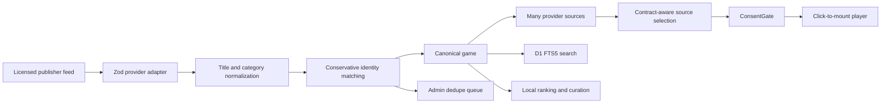

# Architecture

## Request and data flow



## Canonical identity and sync

- Slug belongs to `games`, not a provider. `(provider_id, provider_game_id)` uniquely identifies a source.
- NFKC normalization preserves numbers, strips redundant punctuation and normalizes apostrophes/dashes. Developer corroboration is required for auto merge. Ambiguous multiple matches enter manual review. Candidate search is bounded to exact title / first-token prefix; it is intentionally conservative and may miss unrelated spelling variants.
- Live and Studio syncs run as Cloudflare Workflows. Each provider page is validated and staged in D1 in a durable step; no catalog records change until the entire feed is validated. Imports then run in resumable batches of 20. The browser receives a job ID immediately. Step retries do not duplicate sources or counters; successful finalization and missing-source updates commit together. Large feeds are never serialized into Workflow step results.
- Each provider has a D1 lease to prevent overlapping syncs. Every run records status, start/end, mode, received/new/updated/missing/errors. Raw URLs, provider response bodies and credential-bearing error messages are not logged.
- Validate and retrieve the catalog before ingestion. Each source's canonical insert and related rows use one D1 transactional batch. If a later database write fails, earlier valid upserts remain reusable on the next idempotent run, but missing-source updates are skipped.
- Missing records are counted only for complete, nonempty, successfully imported catalogs. Three successful disappearance cycles deactivate a source. Empty feeds fail safe; investigate true catalog withdrawal manually. Explicit licensing withdrawals should be disabled immediately by an operator and should not wait three days.
- Manual source disable, priority and URL overrides survive sync. Edited canonical descriptions/categories are protected by `editorial_locked`.
- Manual merge preserves the target URL, transfers sources, categories, pins and metrics, removes the duplicate game and creates a redirect only for the donor's already existing URL. LocalStorage retains old slugs until its next visit; the redirect takes the player to the canonical page.

## Ranking and curation

Provider raw rank becomes a percentile within a completed catalog. The quality score uses the highest eligible source percentile. Discovery rankings combine this with first-party game starts and favorites (favorites weigh 3); the recent score uses a seven-day window. Bounded engagement fractions prevent large historic totals from overwhelming a newer game. Ranking never uses estimated ad revenue or internal game events. Run recomputation after sync, on the daily schedule, or from Studio.

Homepage sections have enablement, position, limit, auto/manual mode, rule and ordered pins. Automatic rules fill after pins. Local Continue Playing respects the configured title, position, enablement and limit, using the current browser's history.

## Security and privacy

- App Router server components access D1 via `cloudflare:workers` and Drizzle. Client components receive only presentation data and selected playable URLs.
- Admin uses validated Cloudflare Access JWTs when team domain and audience are configured. A partial Access configuration fails closed. With neither Access variable configured, it uses eight-hour HS256 sessions with a 32+ character secret and HttpOnly / SameSite=Strict cookies. Secure is mandatory outside explicitly local mode. There is no default production password. Origin checking protects all mutations and D1 throttles login/API POSTs.
- Nonce CSP permits only same-origin scripts and explicitly configured image/frame hosts. Production has no unsafe-eval. Inline CSS is allowed for React styles and the framework's styling. Camera, microphone and geolocation are denied. The player has no sandbox and only adapter-approved `allow` permissions. Changing permissions should follow the relevant game/provider documentation.
- Static assets are served by Cloudflare's asset layer, not intercepted first by the SSR Worker; doing otherwise breaks Vite's development module graph. All dynamic routes still go through Worker auth/security logic. Admin additionally rechecks auth server-side.
- Feed metadata is plain text. No provider HTML is rendered. External fetches use bounded bodies, timeouts and exact HTTPS origin validation. XML entities and DOCTYPE are rejected.
- Source health stores discovery, HTTP reachability, iframe attempts/loads and fallback counts separately. None is labeled as verified gameplay success.
- Anonymous product events are aggregate counters. D1 transient rate-limit keys use IP solely for throttling and are cleaned on schedule. No advertising revenue numbers or fabricated ratings are shown.

## Consent integration

`CONSENT_REQUIRED=true` keeps a real iframe blocked until the user allows it. `PLAYER_PERMISSION_MODE=site` explicitly enables the built-in dialog in the configured environment, including production. It stores a tab-scoped choice in sessionStorage, requires Allow followed by Play, supports denial and immediate revocation, and works in memory when storage is blocked. The previous development-only storage key is never reused. An existing external manager is never overwritten.

This dialog controls loading the iframe; it does not create advertising consent strings, claim CMP certification, alter provider SDKs, or replace the provider's privacy choices. Withdrawing permission unmounts the player and resets Play; granting it again does not automatically restart the game or delete third-party cookies.

To integrate a separate privacy manager, set `PLAYER_PERMISSION_MODE=external` and implement this application-owned bridge:

```ts
window.arcadeConsent = {
  hasConsent: () => approvedCmpAllowsGameEmbedding(),
  subscribe: (listener) => subscribeToApprovedCmpChanges(listener),
  requestConsent: () => openApprovedCmpSettings(),
};
window.dispatchEvent(new Event("arcade:cmp-ready"));
```

Those placeholder functions refer to your CMP integration, not invented provider APIs. `subscribe` must return an unsubscribe function. Denial/revocation unmounts the iframe. In external mode, a missing manager keeps the player blocked and shows an unavailable message. `CONSENT_REQUIRED` remains true for the deployed site; fixing the missing production choice did not disable the gate.

## SEO

Noindex is independent of playability. Fixture/preview pages cannot be promoted to production search discovery. Sitemap includes only the production homepage, eligible categories with real indexable games, and real published indexable games. JSON-LD contains observed metadata only. Category promotion is independent and defaults off. You must supply meaningful editorial content; no synthetic rating/review/developer data is generated.

## Performance

Discovery and game content are server rendered. No game iframe exists before Play. Images are lazy except hero/player cover; fixed aspect ratios prevent layout shift. Locally bundled variable fonts avoid third-party font requests. Client-only controls remain disabled until hydration so the first click cannot disappear while the runtime boots. The CSS supports reduced motion. No external game SDK is added to the top-level page.

## Durable sync operations

The `CATALOG_SYNC` Workflow binding is declared separately for local, preview and production. Workers and the Workflow class deploy together; no separate job server or Redis is needed. Daily cron queues configured providers, then exits. The local seed CLI retains a synchronous path for small fixtures. Studio uses the durable path whenever its binding is configured, including local validation.

A per-provider lease lasts two hours and is renewed for every staged/imported batch. A crashed job can be retried idempotently. After lease expiry, the next job marks an abandoned running record as failed. Monitor Workflow failures and D1/Workers plan quotas in Cloudflare; a full commercial catalog is not expected to fit free-tier daily write limits.

References: [Cloudflare Workflows guide](https://developers.cloudflare.com/workflows/get-started/guide/), [Workers invocation limits](https://developers.cloudflare.com/workers/platform/limits/).
